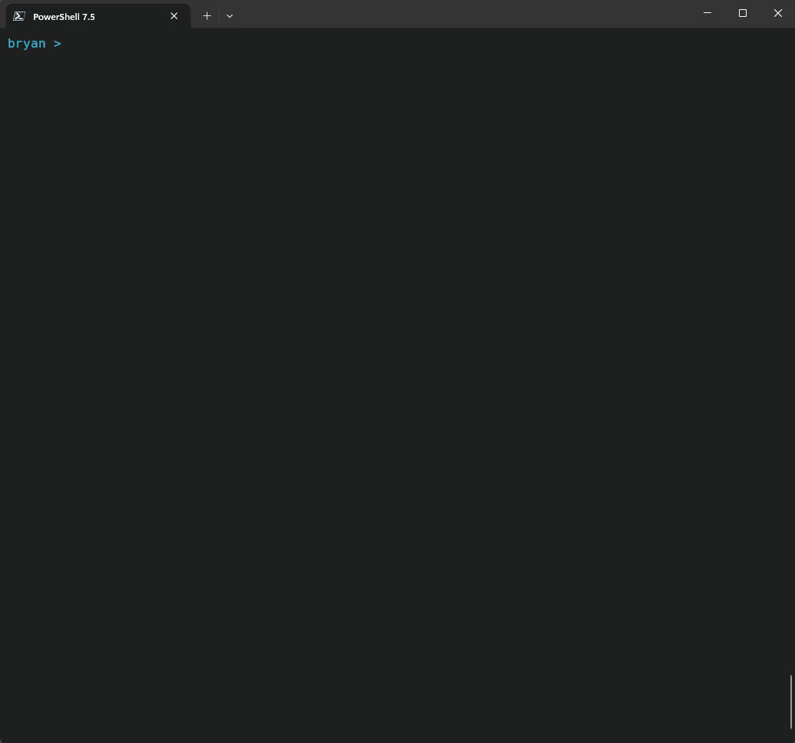

# Wikit

CLI and TUI for managing Wiki.js instances.



## Features

- **Multi-instance support**: Manage multiple Wiki.js instances with encrypted configuration
- **CLI commands**: Direct command-line operations for automation
- **Interactive TUI**: Full-featured terminal user interface with React/Ink
- **Page management**: Browse, search, edit, move, and delete pages
- **Navigation management**: Create, edit, move, and delete navigation items
- **User management**: Create, edit, and manage Wiki.js users and profiles
- **Group management**: Manage groups, members, permissions, and page rules
- **Bulk operations**: Delete multiple pages or navigation items at once
- **Content analysis**: Analyze page structure, find orphaned pages, compare navigation
- **Instance sync**: Compare and synchronize configurations between instances
- **Theme support**: Multiple color themes with Nerd Font icon support

## Installation

### As CLI Tool

```bash
npm install -g @bryance/wikit
wikit --help
```

### As Library (for MCP or other tools)

```bash
npm install @bryance/wikit
```

## Programmatic Usage

### Import Commands

```typescript
import { listPages, syncPages, getStatus } from '@bryance/wikit/commands';
import { WikiConfig } from '@bryance/wikit/types';

const config: WikiConfig = {
  // your config
};

const pages = await listPages({ instance: 'primary' });
```

### Import API Layer

```typescript
import { createClient, pagesQuery } from '@bryance/wikit/api';
```

### Import Types Only

```typescript
import type { Page, User, NavigationItem } from '@bryance/wikit/types';
```

## Available Exports

- `@bryance/wikit` - Main CLI entry
- `@bryance/wikit/commands` - All command functions
- `@bryance/wikit/api` - GraphQL API layer
- `@bryance/wikit/types` - TypeScript types
- `@bryance/wikit/utils` - Utility functions
- `@bryance/wikit/config` - Configuration management

## Configuration

### First-Time Setup

When you run Wikit for the first time, the built-in setup wizard will guide you through configuring your first Wiki.js instance:

```bash
wikit tui
```

The wizard will prompt you for:
- Instance ID (e.g., 'mywiki')
- Display name
- Wiki.js API URL (e.g., 'https://your-wiki.com/graphql')
- API key

Your credentials are stored encrypted in `~/.config/wikit/config.json` on Linux/macOS or `C:\Users\<User>\.config\wikit\config.json` on Windows.

### Getting Wiki.js API Keys

1. Log into your Wiki.js admin panel
2. Go to **Administration** → **API Access**
3. Create a new API key with appropriate permissions
4. Copy the generated key when prompted by the setup wizard

### Managing Multiple Instances

Add additional Wiki.js instances using:

```bash
wikit config --add
```

List all configured instances:

```bash
wikit config --list
```

Switch between instances using the `-i/--instance` flag:

```bash
wikit -i mywiki list /en/docs
```

### Legacy .env Configuration (Optional)

For backwards compatibility, you can still use a `.env` file in the project root:

```env
# First instance
WIKI1_API_URL=https://wiki1.example.com/graphql
WIKI1_API_KEY=your-api-key-here

# Second instance (optional)
WIKI2_API_URL=https://wiki2.example.com/graphql
WIKI2_API_KEY=your-api-key-here
```

The encrypted configuration is recommended as it's more secure and supports unlimited instances.

## CLI Usage

### Commands

### Global Options

- `-i, --instance <name>`: Specify Wiki instance

### List Pages

List pages under a specific path prefix:

```bash
wikit list <prefix> [options]

# Examples
wikit list /en/docs                    # List pages under /en/docs
wikit list /en/docs --recursive        # Include nested pages
wikit list /en/docs --limit 50         # Limit to 50 results
wikit list /en/docs --all              # Show all pages if no matches
wikit -i wiki2 list /en/guides         # Use different instance
```

**Options:**
- `-l, --limit <number>`: Limit number of results (0 = all, default: 0)
- `--all`: Show all pages if no matches found
- `-r, --recursive`: Include nested pages (default: only direct children)

### Delete Pages

Delete pages under a specific path prefix:

```bash
wikit delete <prefix> [options]

# Examples
wikit delete /en/old-docs              # Delete with confirmation
wikit delete /en/temp --force          # Skip confirmation prompt
```

**Options:**
- `-f, --force`: Skip confirmation prompt

### Compare Instances

Compare configurations and content between instances:

```bash
wikit compare [options]

# Examples
wikit compare --config                 # Compare site configuration
wikit compare --theme --assets         # Compare theme and assets
wikit compare --pages --details        # Compare pages with details
wikit compare --all                    # Compare everything
wikit compare --page-prefix /en/docs   # Compare specific page prefix
wikit compare --from wiki1 --to wiki2  # Specify instances
```

**Options:**
- `--from <instance>`: Source instance
- `--to <instance>`: Target instance
- `--config`: Compare site configuration
- `--theme`: Compare theme configuration
- `--assets`: Compare asset configuration
- `--pages`: Compare page summaries
- `--users`: Compare user summaries
- `--system`: Compare system information
- `--all`: Compare all configurations
- `--details`: Show detailed comparison
- `--page-prefix <prefix>`: Compare pages under specific prefix

### Instance Status

Show status and differences between instances:

```bash
wikit status [options]

# Examples
wikit status                           # Basic status comparison
wikit status --verbose                 # Detailed status information
wikit status --from wiki1 --to wiki2   # Specify instances
```

**Options:**
- `--from <instance>`: First instance
- `--to <instance>`: Second instance
- `--verbose`: Show verbose output

### Sync Instances

Synchronize configurations between instances:

```bash
wikit sync [options]

# Examples
wikit sync --config                    # Sync site configuration
wikit sync --theme --assets            # Sync theme and assets
wikit sync --pages                     # Sync all pages
wikit sync --pages --page-prefix /en/docs # Sync specific pages
wikit sync --all --dry-run             # Preview all changes
wikit sync --config --force            # Skip confirmation
```

**Options:**
- `--from <instance>`: Source instance
- `--to <instance>`: Target instance
- `--config`: Sync site configuration
- `--theme`: Sync theme configuration
- `--assets`: Sync asset configuration
- `--pages`: Sync pages content
- `--page-prefix <prefix>`: Only sync pages with this path prefix
- `--all`: Sync all configurations and pages
- `--dry-run`: Show what would be synced without making changes
- `--force`: Skip confirmation prompt

### Interactive TUI

Launch the terminal user interface:

```bash
wikit tui

# Examples
wikit tui                              # Launch TUI with default instance
wikit -i wiki2 tui                     # Launch TUI with specific instance
```

## Terminal User Interface (TUI)

The TUI provides an interactive terminal interface with the following features:

### Keyboard Navigation

The TUI follows consistent keyboard patterns across all interfaces:

**Core Navigation:**
- **↑↓** (Arrow Up/Down): Navigate through lists and menus
- **→←** (Arrow Right/Left): Expand/collapse tree items or navigate button groups
- **Enter**: Confirm selection, open items, or submit forms
- **Space**: Toggle selections in multi-select lists
- **Esc**: Go back, cancel, or exit current mode

**Standard Patterns:**
- **Lists**: ↑↓ to navigate, Enter to select, Esc to go back
- **Multi-select**: ↑↓ to navigate, Space to toggle, Enter to confirm, Esc to cancel
- **Trees**: ↑↓ to navigate, → to expand, ← to collapse, Enter to select
- **Forms**: ↑↓ to navigate fields, Enter to edit/submit, Esc to cancel
- **Menus**: ↑↓ to navigate options, Enter to select, Esc to close

### Commands

Once in TUI mode, you can use these commands:

**Page Management:**
- `pages`: Browse, search, and manage wiki pages with detailed views
- `search [query]`: Search for pages by title or path

**Navigation Management:**
- `nav` or `navigation`: Manage navigation tree (add, edit, move, delete items)

**User & Group Management:**
- `users`: Create, edit, and manage Wiki.js users
- `groups`: Manage groups, members, permissions, and page rules

**Analysis & Comparison:**
- `analyze`: Analyze page structure, find orphaned pages, compare navigation
- `compare`: Compare pages between instances
- `status`: Show instance status and info

**Instance Operations:**
- `copy`: Copy pages between instances
- `sync`: Synchronize configurations between instances
- `config`: Manage instance configurations

**Interface:**
- `theme`: Switch between color themes
- `i [instance]`: Switch Wiki.js instance
- `help`: Show help screen with keyboard shortcuts
- `exit` or `quit`: Exit TUI

### Key Interfaces

**Pages Interface:**
- Browse all pages with virtualized scrolling
- View detailed page information (content, metadata, tags)
- Edit page properties and content
- Move pages to different paths
- Convert between editor types (markdown/code)
- Delete single or multiple pages
- Export pages to JSON

**Navigation Interface:**
- View and manage navigation tree structure
- Add new items (links, headers, dividers)
- Edit existing navigation items
- Move items with visual placement picker
- Delete navigation items (single or bulk)
- Import/export navigation configurations

**Users Interface:**
- List all Wiki.js users
- Create new users with group assignments
- Edit user details and passwords
- Manage user group memberships
- Delete users with confirmation
- Import/export user profiles

**Groups Interface:**
- View all groups and their members
- Create new groups with permissions
- Manage group membership (add/remove users)
- View and edit group permissions
- Configure page access rules
- Find orphaned users (not in any group)

**Analysis Interface:**
- Analyze page structure and relationships
- Find orphaned pages (no navigation links)
- Compare navigation between instances
- Compare page content and metadata
- Export analysis results

### Interactive Features

- **Real-time search**: Type to filter results instantly across all interfaces
- **Bulk selection**: Mark multiple items for batch operations
- **Confirmation dialogs**: Safe operations with detailed confirmation prompts
- **Visual previews**: See changes before applying (navigation placement, etc.)
- **Async operations**: Background processing with progress indicators
- **Context-aware help**: Footer shows relevant keyboard shortcuts for current screen
- **Theme switching**: Multiple color themes (Dracula, Tokyo Night, Monokai, etc.)
- **Nerd Font support**: Rich icons when Nerd Fonts are available

## Development

### Project Structure

```
src/
├── index.ts                    # CLI entry point with Commander.js
├── api/                        # GraphQL API layer
│   ├── index.ts                # Core graphql() function
│   ├── pages.ts                # Page queries/mutations
│   ├── navigation.ts           # Navigation queries/mutations
│   ├── users.ts                # User queries/mutations
│   ├── groups.ts               # Group queries/mutations
│   └── config.ts               # Configuration queries
├── commands/                   # CLI command implementations
│   ├── pages.ts                # Page management commands
│   ├── navigation.ts           # Navigation commands
│   ├── users.ts                # User management commands
│   ├── groups.ts               # Group management commands
│   ├── analyze.ts              # Analysis commands
│   ├── compare.ts              # Comparison commands
│   ├── sync.ts                 # Synchronization commands
│   └── config.ts               # Configuration commands
├── config/                     # Configuration management
│   ├── configManager.ts        # Core config CRUD operations
│   ├── dynamicConfig.ts        # Runtime configuration
│   └── migration.ts            # Config migration utilities
├── contexts/                   # Global state management
│   └── InstanceContext.ts      # Singleton instance manager
├── types/                      # TypeScript type definitions
│   ├── page/                   # Page-related types
│   ├── navigation/             # Navigation types
│   ├── user/                   # User types
│   ├── group/                  # Group types
│   └── ...                     # Other domain types
├── utils/                      # Utility functions
│   ├── analyzer.ts             # Page analysis utilities
│   ├── commandParser.ts        # Command parsing
│   └── ...                     # Other utilities
└── tui/                        # Terminal UI (React/Ink)
    ├── AppContent.tsx          # Main TUI router
    ├── components/
    │   ├── interfaces/         # Main feature interfaces
    │   │   ├── pages/          # Pages interface
    │   │   ├── navigation/     # Navigation interface
    │   │   ├── users/          # Users interface
    │   │   ├── groups/         # Groups interface
    │   │   ├── analysis/       # Analysis interface
    │   │   └── ...             # Other interfaces
    │   ├── ui/                 # Reusable UI components
    │   │   ├── VirtualizedList.tsx
    │   │   ├── Table.tsx
    │   │   └── ...
    │   └── modals/             # Dialog components
    ├── contexts/               # React contexts
    │   ├── ThemeContext.tsx    # Theme management
    │   ├── HeaderContext.tsx   # Header state (stack-based)
    │   ├── FooterContext.tsx   # Footer help text
    │   ├── EscapeContext.tsx   # Escape key handlers
    │   └── IconContext.tsx     # Icon formatting
    ├── themes/                 # Color theme definitions
    └── hooks/                  # Custom React hooks
```

### Available Scripts

- `bun run dev`: Run in development mode (src/index.ts)
- `bun run build`: Build for production (outputs to dist/)
- `bun run start`: Run built version (dist/index.js)
- `bun run typecheck`: Run TypeScript type checking
- `bun run lint`: Run ESLint

### Architecture Patterns

**InstanceContext Singleton:**
The application uses a global `InstanceContext` singleton to manage the current Wiki.js instance:
- CLI mode: A preAction hook in `src/index.ts` sets the instance before commands run
- TUI mode: `AppContent` syncs instance state with the context via useEffect
- API layer: The `graphql()` function automatically uses `InstanceContext.getInstance()`
- Benefits: Eliminates prop drilling, cleaner function signatures, centralized management

**Context Stack Pattern:**
Several contexts use a stack-based approach:
- `HeaderContext`: Components push header data, automatically restored on unmount
- `FooterContext`: Stack-based help text management
- `EscapeContext`: Stacked escape handlers for nested modals/dialogs

**Keyboard Navigation:**
Consistent patterns across all interfaces:
- Arrow keys for navigation
- Space for toggle/selection
- Enter for confirm/action
- Escape for back/cancel
- Defined in `src/tui/constants/keyboard.ts`

### Adding New Features

**Adding CLI Commands:**
1. Create command function in `src/commands/[feature].ts`
2. Add command definition to `src/index.ts` (Commander.js)
3. Define types in `src/types/[feature]/`
4. Create API functions in `src/api/[feature].ts`

**Adding TUI Interfaces:**
1. Create interface component in `src/tui/components/interfaces/[feature]/`
2. Add command to `src/tui/commands.ts`
3. Update `AppContent.tsx` mode handling
4. Use consistent keyboard navigation patterns
5. Use context hooks (useHeaderData, useFooterHelp, useEscape)

**Adding API Functions:**
1. Define GraphQL queries/mutations in `src/api/[feature].ts`
2. Use the core `graphql()` function from `src/api/index.ts`
3. Define response types in `src/types/[feature]/`
4. No need to pass instance - it's handled by InstanceContext

### Theme Customization

Themes are defined in `src/tui/themes/`. The application includes:
- Dracula
- Tokyo Night
- Monokai
- Synthwave
- Duskfox
- Horizon
- Scarlet Protocol
- ILS Theme

Create new themes by implementing the `Theme` interface from `src/tui/themes/types.ts`.

## Troubleshooting

### Common Issues

**API Connection Errors:**
- Verify your API URL is correct and accessible
- Ensure API key has proper permissions
- Check that GraphQL endpoint is enabled in Wiki.js

**Missing Environment Variables:**
- Ensure `.env` file is in project root
- Verify all required variables are set
- Check variable names match exactly (case-sensitive)

**Permission Errors:**
- API key must have admin privileges
- Some operations require specific permissions in Wiki.js

**TUI Display Issues:**
- Ensure terminal supports ANSI colors
- Try resizing terminal window
- Use `wikit --help` for CLI-only mode

### Getting Help

- Use `wikit --help` for CLI help
- Use `wikit tui` then type `help` for TUI help
- Check Wiki.js documentation for API configuration
- Verify GraphQL endpoint is working: `curl -X POST [your-api-url]`

## License

MIT License - see LICENSE file for details.
